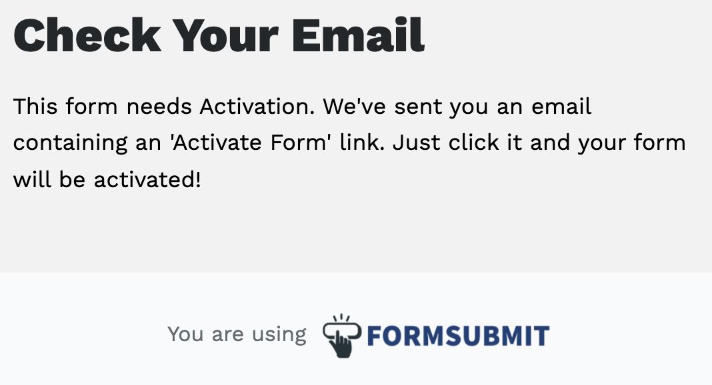

# Updated_Portfolio_Page 

## Description
Welcome to my updated portfolio!

## Table of Contents

- [Installation](#installation)
- [Usage](#usage)
- [License](#license)
- [Contributing](#contributing)
- [Tests](#tests)
- [Questions](#questions)

## Installation 
No installation required
## Usage
Greetings! I am an aspiring software developer currently attending class at the University of Washington. Now that I have more coding experience, I was able to fill out more of my page and add some languages that I have learned and some that I hope to learn. I also updated my portfolio section with the assignments we have completed and added a link to my GitHub page and my Resume. 

## License
This project is covered under the MIT license. 

## Contributing
University of Washington Coding Camp
## Tests
n/a
## Questions
Please feel free to contact me with any questions or suggestions either on my GitHub account or via email.
* GitHub: https://github.com/Taylor25et
* E-Mail: taylor25et@gmail.com

[DeployedUpdatedPortfolio](https://taylor25et.github.io/Updated_Portfolio_Page/)

[GitHubRepo](https://github.com/Taylor25et/Updated_Portfolio_Page)
