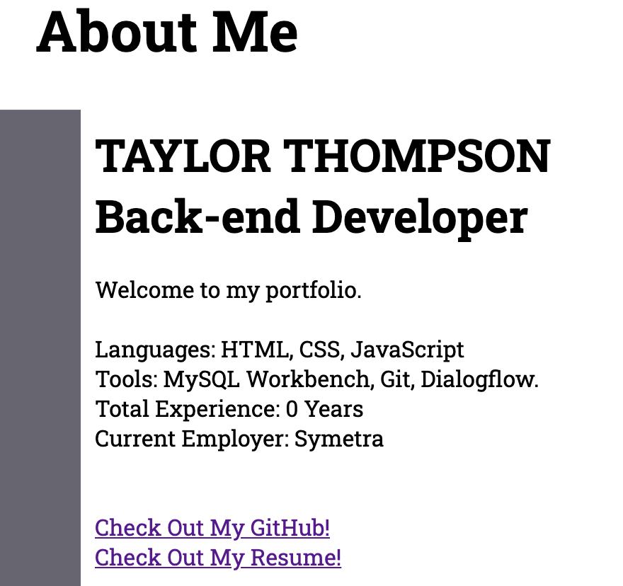
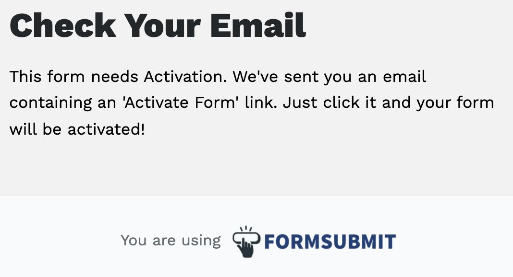

# Updated_Portfolio_Page
Welcome to my updated portfolio.

Task Objectives
* Updated portfolio featuring Project 1 and two exemplary homework assignments.
* Updated GitHub profile with pinned repositories featuring Project 1 and two exemplary assignments.
* Updated resume
* Updated LinkedIn profile

Special Note: Our teacher said that we did not have to link our updated LinkedIn if it would cause problems at work. If my company thought I was trying to leave the company this would cause issues for me. Please check with Brian before subtracting points.

Also, I only have the project and HW 4 done so I do not have a second assignment to link. I’ll be working on HW 5 this week and will go ahead and link it once it is completed.

Process for Updating my Page:
Now that I have more coding experience, I was able to fill out more of my page and add some languages that I have learned and some that I hope to learn. I also updated my portfolio section with the assignments we have completed and added a link to my GitHub page and my Resume. 

Please note that in class this week we are revamping our resumes so mine will get updated once that is finished. My contact info isn’t displayed just because I have a box where people can message me if they want to connect. More on this later. This is a stylistic choice, not something that was left out.

I am taking this class in order to transfer to the software development team where I currently work. Our developers only do back-end work which is why my profile is geared towards that audience. I also made it so that the services that I offer fit more in line with what I know our managers are looking for. In class we are only just starting the back-end portion of our class so there will be more to put here eventually.

For the contact box portion:
My tutor showed me and API that I can add that takes the entered information and sends it to my email. This is perfect since I don’t want my information displayed and prefer having more of a filter.

[DeployedUpdatedPortfolio](https://taylor25et.github.io/Updated_Portfolio_Page/)
[DeployedUpdatedPortfolio](https://github.com/Taylor25et/Updated_Portfolio_Page)
